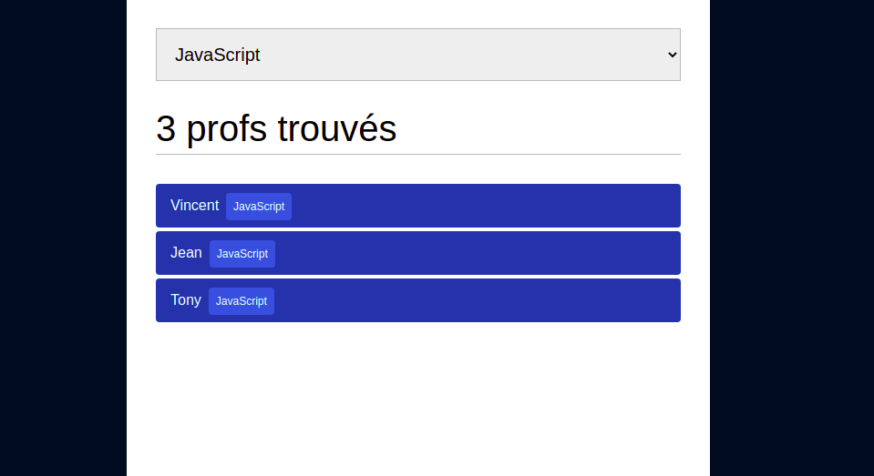
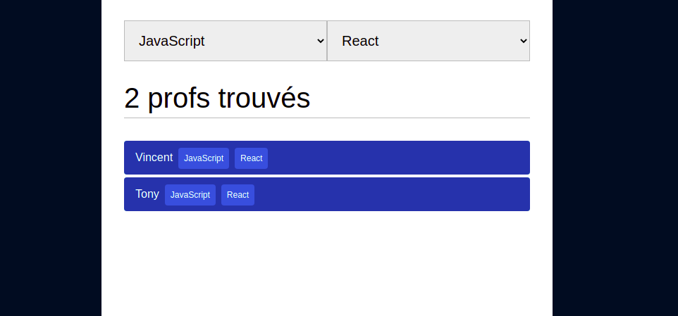

# Teacher Finder

On veut créer une application pour trouver des profs en fonction d'un langage de base et/ou une spécialité

Pour bien se préparer à ce qu'on va faire dans la suite de la spé on s'ajoute une contrainte : 
- On ne touche pas au HTML, on va construire tous nos élements HTML en Javascript
- On pourra modifier les styles dans le CSS

Résultat attendu : 



## 1. Création de l'interface

Utilise Javascript pour créer des balises et les insérer dans le document.

Pour cela retrouve comment manipuler le DOM en ciblant des élements, en créant de nouveaux élements, en les modifiant et en les insérant.

Modifie les CSS pour te rapprocher du modèle. Les codes couleurs sont fournis dans le fichier CSS.

On veut 3 zones : 
- Un formulaire contenant un `select` pour choisir entre 2 options : `PHP` et `JavaScript`
- Un compteur qui affiche le nombre de résultats
- Une liste de profs avec leur nom et un tag spécifiant leur langage de prédiléction 

Tu trouveras ci-dessous la liste complète des profs, pour le moment on ne s'occupe que du langage de base, la spécialité viendra en bonus

<details>
  <summary>
    Liste des profs
  </summary>

```js
[
  {
    name: 'Loris',
    language: 'PHP',
    speciality: 'WordPress',
  },
  {
    name: 'Jean',
    language: 'JavaScript',
    speciality: 'Data',
  },
  {
    name: 'Jean-Christophe',
    language: 'PHP',
    speciality: 'Symfony',
  },
  {
    name: 'Jean-Philippe',
    language: 'PHP',
    speciality: 'Symfony',
  },
  {
    name: 'Julien',
    language: 'PHP',
    speciality: 'React',
  },
  {
    name: 'Vincent',
    language: 'JavaScript',
    speciality: 'React',
  },
  {
    name: 'Tony',
    language: 'JavaScript',
    speciality: 'React',
  },
]
```
</details>

## 2. Intéractions

Pose un écouteur d'événement pour réagir quand la valeur sélectionnée **change**.

On veut alors filter la liste des profs et mettre à jour le compteur en fonction du langage choisi. Il faut faire en sorte de n'afficher que les profs pratiquant le langage choisi.

## Bonus : 2ème filtre

- Ajoute un 2ème filtre à ton interface pour les spécialités
- Pose un écouteur pour réagir quand la valeur du 2ème `select` change
- Filtre la liste en fonction des `select`

